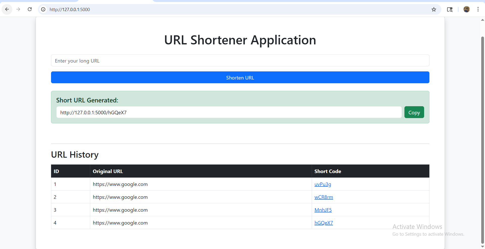

# 🔗 URL Shortener Application

A modern Flask-based URL Shortener web application that converts long URLs into short and shareable links. This project demonstrates backend development, database integration, routing, and web application deployment concepts using Python and Flask.

---

## 🚀 Live Demo

After deployment, your project live link will look similar to this:

```bash
https://url-shortener-flask.onrender.com
```

You can deploy this project for free using:

* Render
* Railway
* PythonAnywhere

---

# 📸 Project Preview

```markdown



```

---

# ✨ Features

* 🔗 Convert long URLs into short links
* 🚀 Instant redirection to original URLs
* 📜 URL history tracking
* 🗄️ SQLite database integration
* 💻 Simple and clean user interface
* ⚡ Fast Flask backend processing
* 📱 Responsive design support
* 🔄 Dynamic short code generation

---

# 🛠️ Technologies Used

| Technology   | Purpose             |
| ------------ | ------------------- |
| Python       | Backend Programming |
| Flask        | Web Framework       |
| SQLite       | Database Management |
| HTML         | Frontend Structure  |
| CSS          | Styling and UI      |
| Git & GitHub | Version Control     |

---

# 📂 Project Structure

```bash
url-shortener-flask/
│
├── app.py
├── database.db
├── requirements.txt
├── README.md
├── .gitignore
│
├── templates/
│   └── index.html
│
└── static/
    └── style.css
```

---

# ⚙️ Installation & Setup

## 1️⃣ Clone Repository

```bash
git clone https://github.com/shaiksohail123-star/url-shortener-flask.git
```

## 2️⃣ Move to Project Folder

```bash
cd url-shortener-flask
```

## 3️⃣ Install Requirements

```bash
pip install -r requirements.txt
```

## 4️⃣ Run Application

```bash
python app.py
```

---

# 🌐 Application URL

After running the project, open:

```bash
http://127.0.0.1:5000
```

---

# 🧠 How It Works

1. User enters a long URL.
2. Flask backend generates a random short code.
3. Original URL and short code are stored in SQLite database.
4. User receives a shortened URL.
5. When the short URL is opened, Flask redirects to the original URL.

---

# 📊 Database Used

This project uses SQLite database.

### Table Structure

| Column     | Type    |
| ---------- | ------- |
| id         | INTEGER |
| long_url   | TEXT    |
| short_code | TEXT    |

---

# 🔒 Future Improvements

* User authentication system
* Custom short URLs
* Analytics dashboard
* QR code generation
* URL expiration feature
* Copy-to-clipboard enhancement
* Cloud database integration
* Deployment with custom domain

---

# 🎯 Learning Outcomes

Through this project, I learned:

* Flask web development
* Routing and redirection
* Database operations using SQLite
* Git and GitHub workflow
* Frontend and backend integration
* Project deployment concepts

---

# 👨‍💻 Author

## Sohail

* GitHub: [https://github.com/shaiksohail123-star](https://github.com/shaiksohail123-star)

---

# ⭐ Support

If you like this project, give it a ⭐ on GitHub.
